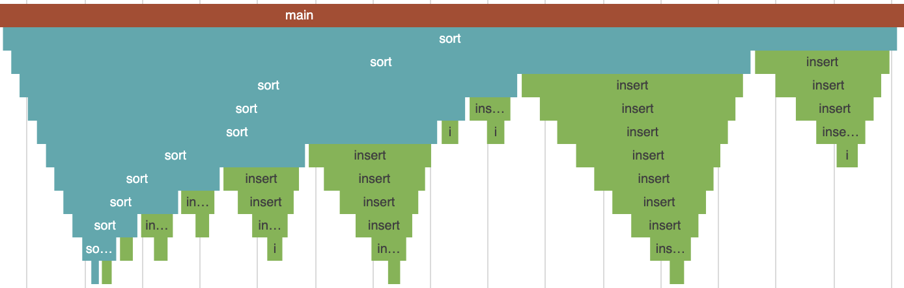

# ppx_debug

A collection of tools for record-and-replay debugging.

This works by instrumenting a program using ppx, running the program to record an execution, then analyzing the execution using editor plugins (which provide an interface like that of an interactive debugger), [Perfetto](https://ui.perfetto.dev/)/[magic-trace](https://magic-trace.org/), the OCaml toplevel, or CLI tools.

- [Tutorial and docs](docs/docs.md)
- [Demo project](demo)
- [OCaml 2022](https://icfp22.sigplan.org/details/ocaml-2022-papers/2/Tracing-OCaml-Programs) [talk](youtube), [abstract](https://dariusf.github.io/tracing-ocaml22.pdf)

**This is an early prototype. Feel free to try it on your projects, but expect rough edges. Contributions are very welcome!**
